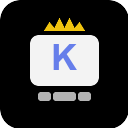

  

<h1 align="center">KeyMaster ⌨️</h1>

  <strong>Domina el teclado. Olvida el ratón.</strong> 
  Extensión de entrenamiento para aprender a usar VS Code, Cursor y Windsurf sin ratón.

  
  
  

  <a href="https://marketplace.visualstudio.com/items?itemName=apliarte.keymaster">VS Marketplace</a> · 
  <a href="https://open-vsx.org/extension/apliarte/keymaster">Open VSX (Cursor/Windsurf/Antigravity)</a> · 
  <a href="https://github.com/erbolamm/key-master">GitHub</a>

---

Cuando haces clic con el ratón en el editor, KeyMaster te muestra el atajo de teclado que deberías usar en su lugar.

## Características

- **Detección de clics de ratón** en el editor de código con notificación del atajo equivalente
- **3 modos de funcionamiento**: Suave (avisa), Estricto (bloquea), Entrenamiento (teclado visual)
- **Interceptor de comandos**: bloquea 20 comandos nativos (abrir settings, terminal, cerrar pestaña...) y te enseña el atajo
- **42 atajos incluidos**: navegación, edición, búsqueda, terminal, Git y más
- **Teclado visual QWERTY** con guía de colores por dedo y posición de reposo
- **Estadísticas de uso**: clics de ratón, atajos mostrados, racha diaria, top 5 atajos
- **Efectos de sonido** opcionales al detectar clic (modo suave y alerta)
- **Toggle rápido** desde la barra de estado o con `Ctrl+Shift+K` / `Cmd+Shift+K`
- **Referencia de atajos** buscable integrada en VS Code
- **Bilingüe**: español e inglés
- Compatible con **VS Code**, **Cursor** y **Windsurf**

## Cómo funciona

1. Instala la extensión
2. KeyMaster aparece en la barra de estado inferior izquierda
3. Actívalo con clic en la barra o con `Cmd+Shift+K` / `Ctrl+Shift+K`
4. Cada vez que hagas clic con el ratón en el editor, verás una notificación con el atajo de teclado que deberías usar
5. En modo estricto, además se bloquean 20 comandos nativos que sueles ejecutar con el ratón

## Modos

| Modo | Comportamiento |
|------|----------------|
| 🟡 Suave (soft) | Detecta clic → muestra atajo → permite la acción |
| 🟠 Estricto (strict) | Detecta clic → muestra atajo → bloquea la acción + intercepta comandos |
| 🔴 Entrenamiento (training) | Como estricto + teclado visual con guía de dedos |

## Atajos de la extensión

| Atajo | Acción |
|-------|--------|
| `Ctrl+Shift+K` / `Cmd+Shift+K` | Activar/Desactivar KeyMaster |
| `Ctrl+Shift+J` / `Cmd+Shift+J` | Abrir teclado visual |

## Comandos

- `KeyMaster: Activar/Desactivar` — Toggle on/off
- `KeyMaster: Cambiar modo` — Elegir entre suave, estricto y entrenamiento
- `KeyMaster: Referencia de atajos` — Lista buscable de atajos de VS Code
- `KeyMaster: Abrir teclado visual` — Panel QWERTY con colores por dedo
- `KeyMaster: Mostrar estadísticas` — Panel con clics, racha y top 5 atajos
- `KeyMaster: Limpiar estadísticas` — Reiniciar contadores

## Configuración

| Opción | Tipo | Predeterminado | Descripción |
|--------|------|----------------|-------------|
| `keymaster.enabled` | boolean | `true` | Activar/desactivar |
| `keymaster.mode` | enum | `"soft"` | Modo: soft, strict, training |
| `keymaster.language` | enum | `"es"` | Idioma: es, en |
| `keymaster.notificationDuration` | number | `3000` | Duración del aviso (ms) |
| `keymaster.showKeyboardOnStart` | boolean | `false` | Abrir teclado al activar |
| `keymaster.soundEnabled` | boolean | `false` | Reproducir sonido al detectar clic |
| `keymaster.statsEnabled` | boolean | `true` | Guardar estadísticas de sesión |

## Compatibilidad

- VS Code >= 1.85.0
- Cursor AI
- Windsurf IDE
- Antigravity
- VS Codium
- Windows / macOS / Linux

## Autor

Javier Mateo (ApliArte) — [github.com/erbolamm](https://github.com/erbolamm)

## 💬 Una nota personal del autor / A personal note from the author

> ℹ️ Nota: El texto siguiente es un mensaje personal del autor, escrito en varios idiomas para que pueda leerlo gente de todo el mundo. Esto no implica que el proyecto tenga soporte funcional completo en esos idiomas.

> ℹ️ Note: The text below is a personal message from the author, written in several languages so people around the world can read it. This does not imply full multilingual feature support in those languages.

🇪🇸 Español

Soy desarrollador indie, autodidacta, aprendí todo desde cero a base de esfuerzo. Tengo TDAH y siempre me costó usar atajos de teclado — mi cerebro prefería el ratón porque era lo "fácil". KeyMaster nació para obligarme a mí mismo a mejorar.

Cuando vi que funcionaba, pensé: ¿por qué guardarlo solo para mí? Así que lo compartí. Si te ayuda a dejar el ratón y ser más productivo, me alegro.

Si te resulta útil, agradecería una ⭐ en GitHub y 5 estrellas en el Marketplace. Y si podés, una pequeña donación ayuda — soy padre de dos niños y cada euro cuenta.

Gracias de corazón por usar KeyMaster.

🇬🇧 English

I'm an indie developer, self-taught, who learned everything from scratch through effort. I have ADHD and always struggled with keyboard shortcuts — my brain preferred the mouse because it was "easy". KeyMaster was born to force myself to improve.

When I saw it worked, I thought: why keep it just for myself? So I shared it. If it helps you ditch the mouse and be more productive, I'm glad.

If it helps you, I'd really appreciate a ⭐ on GitHub and 5 stars on the Marketplace. And if you can, a small donation would help enormously — I'm a father of two kids and every euro counts.

Thank you from the bottom of my heart for using KeyMaster.

🇧🇷 Português

Sou um desenvolvedor indie, autodidata, que aprendeu tudo do zero com muito esforço. Tenho TDAH e sempre tive dificuldade com atalhos de teclado — meu cérebro preferia o mouse porque era o "fácil". KeyMaster nasceu para me forçar a melhorar.

Quando vi que funcionava, pensei: por que guardar só para mim? Então compartilhei. Se te ajuda a largar o mouse e ser mais produtivo, fico feliz.

Se te for útil, agradeceria uma ⭐ no GitHub e 5 estrelas no Marketplace. E se puder, uma pequena doação ajudaria muito — sou pai de duas crianças e cada euro conta.

Obrigado de coração por usar o KeyMaster.

🇫🇷 Français

Je suis développeur indie, autodidacte, j'ai tout appris par moi-même. J'ai un TDAH et j'ai toujours eu du mal avec les raccourcis clavier — mon cerveau préférait la souris parce que c'était "facile". KeyMaster est né pour me forcer à m'améliorer.

Quand j'ai vu que ça marchait, je me suis dit : pourquoi le garder pour moi seul ? Alors je l'ai partagé. Si ça t'aide à lâcher la souris et être plus productif, j'en suis content.

Si ça t'est utile, je serais reconnaissant pour une ⭐ sur GitHub et 5 étoiles sur le Marketplace. Et si tu peux, un petit don aiderait beaucoup — je suis père de deux enfants.

Merci du fond du cœur d'utiliser KeyMaster.

🇩🇪 Deutsch

Ich bin Indie-Entwickler, Autodidakt, habe alles von Grund auf gelernt. Ich habe ADHS und hatte immer Probleme mit Tastenkombinationen — mein Gehirn bevorzugte die Maus, weil es "einfacher" war. KeyMaster entstand, um mich selbst zu zwingen, besser zu werden.

Als es funktionierte, dachte ich: Warum nur für mich behalten? Also habe ich es geteilt. Wenn es dir hilft, die Maus loszulassen und produktiver zu sein, freut mich das.

Wenn es dir hilft, würde ich mich über einen ⭐ auf GitHub und 5 Sterne im Marketplace freuen. Und wenn du kannst, würde eine kleine Spende sehr helfen — ich bin Vater von zwei Kindern.

Danke von Herzen, dass du KeyMaster benutzt.

🇮🇹 Italiano

Sono uno sviluppatore indie, autodidatta, ho imparato tutto da zero. Ho l'ADHD e ho sempre fatto fatica con le scorciatoie da tastiera — il mio cervello preferiva il mouse perché era "facile". KeyMaster è nato per costringermi a migliorare.

Quando ho visto che funzionava, ho pensato: perché tenerlo solo per me? Così l'ho condiviso. Se ti aiuta a lasciare il mouse e essere più produttivo, ne sono contento.

Se ti è utile, apprezzerei una ⭐ su GitHub e 5 stelle sul Marketplace. E se puoi, una piccola donazione aiuterebbe molto — sono padre di due bambini.

Grazie di cuore per usare KeyMaster.

## 💖 Apoya el proyecto

Herramienta gratuita y open source. Si te ahorra tiempo, un café ayuda a mantener el desarrollo.

| Plataforma | Enlace |
|-----------|--------|
| PayPal | [paypal.me/erbolamm](https://paypal.me/erbolamm) |
| Ko-fi | [ko-fi.com/C0C11TWR1K](https://ko-fi.com/C0C11TWR1K) |
| Twitch Tip | [streamelements.com/apliarte/tip](https://streamelements.com/apliarte/tip) |

🌐 [Sitio oficial](https://apliarte-click-pro-2026.web.app/) · 📦 [GitHub](https://github.com/erbolamm/key-master)

## Licencia

MIT — © 2026 ApliArte